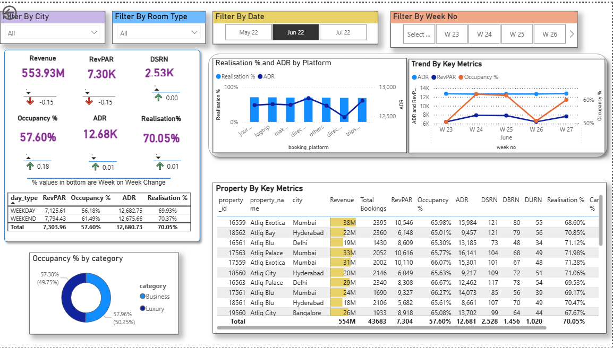
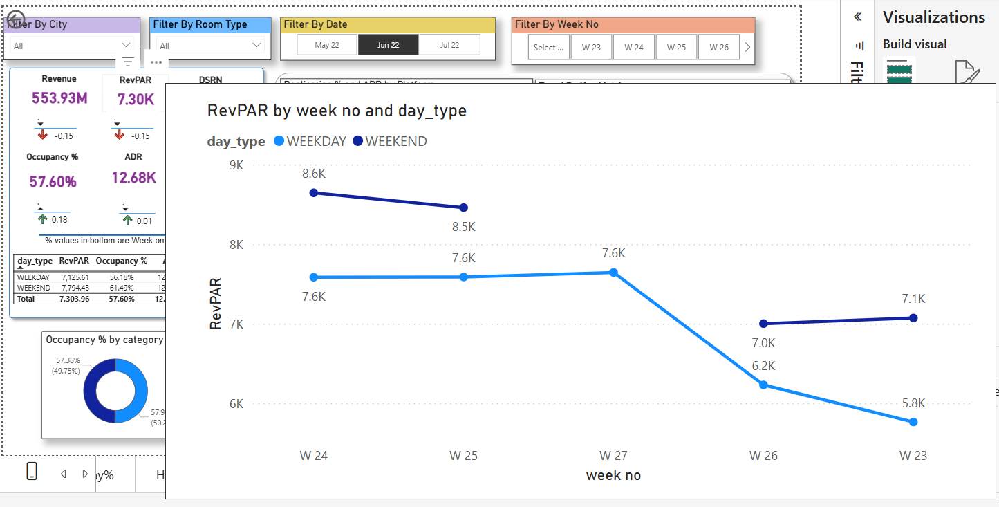
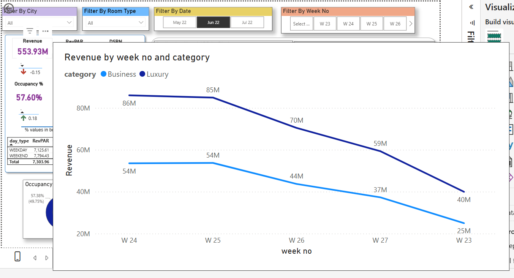

# 🏨 Data-Driven Hospitality Management System

## 🎯 Project Overview
This project is a comprehensive **Business Intelligence (BI) solution** developed to solve revenue management challenges in the hospitality sector. By transforming raw booking data into actionable insights, this dashboard enables hotel managers to monitor **Revenue Per Available Room (RevPAR)**, **Average Daily Rate (ADR)**, and **Occupancy %** in real-time.

  
   
  <b><i>Figure 1: Executive Revenue & Booking Analysis Dashboard</i></b>

---

## 🚀 Key Features & Interactive Elements

### 🔍 Advanced Data Visualization
I utilized **Custom Tooltips** to provide deeper context without cluttering the main UI. Users can hover over any metric to see daily trends and performance by category.

| RevPAR Analysis by Day Type | Revenue Trends by Category |
| :---: | :---: |
|  |  |
| *Figure 2: RevPAR by week no and day_type* | *Figure 3: Revenue by week no and category* |
---

## 🛠️ Technical Stack & Implementation
* **Power BI:** Developed the full interactive reporting environment.
* **Data Modeling:** Built a robust Star Schema involving fact tables and dimension tables (Date, Hotel, Room).
* * **Power Query (M):** Cleaned and transformed datasets including `fact_bookings` and `dim_date`.
* **DAX Calculations:** Engineered custom measures for:
    * **RevPAR** (Revenue Per Available Room)
    * **ADR** (Average Daily Rate)
    * **Occupancy %** and **Realization %**
    * **WoW Change:** Comparative metrics to track performance against the previous week.
* **UI/UX:** Designed with a focus on "Data-to-Ink" ratio, using color-coded filters and WoW (Week-on-Week) indicators.

---

## 📂 Repository Structure
* `/data`: Contains the raw CSV/Excel datasets.
* `/images`: Screenshots and GIFs of the dashboard.
* `Hospitality_Management.pbix`: The main Power BI project file.

---

## 🚀 Features

* **Dynamic Filtering:** Filter data by City, Room Type, Month, and Week Number.
* **WoW Performance Tracking:** Visual indicators (Red/Green arrows) showing growth or decline in KPIs.
* **Property Ranking:** A detailed table ranking hotels by revenue and rating for competitive analysis.
* **Mobile-Friendly Layout:** Optimized visual placement for accessibility across devices.

---

## 📂 How to Use

1. **Download:** Clone this repository or download the `.pbix` file.
2. **Open:** Launch the file in [Power BI Desktop](https://powerbi.microsoft.com/desktop/).
3. **Interact:** Use the slicers at the top to filter data; hover over the charts to see the **Hidden Tooltip** insights.

---

